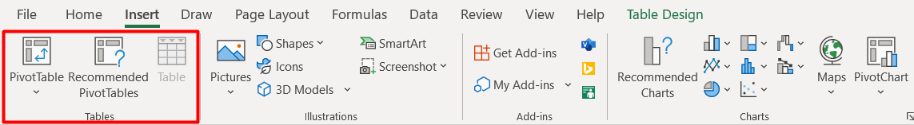

# Creating a Pivot Table

## Overview

In this section, you will learn how to create a [**Pivot Table**](https://support.microsoft.com/en-us/office/overview-of-pivottables-and-pivotcharts-527c8fa3-02c0-445a-a2db-7794676bce96) using Microsoft Excel. Pivot Tables allow you to analyze, summarize, and manipulate data easily, making them an essential tool for both individuals and teams working with large datasets. Using Pivot Tables provides several advantages:

- Simplified Data Analysis
- Quick Data Summarization
- Dynamic Data Filtering
- Enhanced Data Visualization

## Creating a Pivot Table

Before you can start analyzing data using Pivot Tables, you need to have a dataset to work with. For this guide, we will assume you have a dataset ready in Excel. Feel free to use our sample table if you do not have a table to work with.

### Employee Table
| ID |Employee Name | Department | Salary |
|----|--------------|------------|--------|
| 1  | John Smith   | Marketing  | $71,234|
| 2  | Sarah Johnson| Finance    | $46,789|
| 3  | James Lee    | Human Resources | $34,567|
| 4  | Emma Davis   | IT         | $84,321|
| 5  | Ryan Brown   | Sales      | $52,678|
| 6  | Emily Chen   | Marketing  | $62,345|
| 7  | Michael Johnson | Finance | $50,123|
| 8  | Karen Kim    | Human Resources | $42,987|
| 9  | Alex Lee     | IT         | $91,234|
| 10 | Ashley Smith | Sales      | $56,789|
| 11 | David Lee    | Marketing  | $64,567|
| 12 | Samantha Davis | Finance  | $48,321|
| 13 | Kevin Brown  | Human Resources | $39,678|
| 14 | Rachel Kim   | IT         | $87,345|
| 15 | Justin Lee   | Sales      | $54,123|
| 16 | Amanda Smith | Marketing  | $68,987|
| 17 | Brandon Johnson | Finance | $45,234|
| 18 | Michelle Kim | Human Resources | $37,789|
| 19 | Erica Lee    | IT         | $79,567|
| 20 | Tyler Brown  | Sales      | $51,321|

1. Open your Excel workbook containing the dataset you want to analyze.

2. Select any cell within the dataset.

3. Go to the Insert tab on the Excel ribbon.

4. Click on the PivotTable button in the Tables group.

    

5. In the Create PivotTable dialog box that appears, ensure the correct data range is selected in the Table/Range field.

6. Choose where you want the Pivot Table to be placed by selecting either:

- **New Worksheet:** Creates a new worksheet in the workbook to place the Pivot Table.
- **Existing Worksheet:** Places the Pivot Table in a specified location on an existing worksheet. Click on the button next to the **Location** field and select the desired cell.

    

7. Click OK to create the Pivot Table.

## Adding Data to the Pivot Table
Now that you have created the Pivot Table, you can add data fields to analyze and summarize your dataset.

1. In the Pivot Table, you will see the PivotTable Fields pane on the right side of the screen. This pane displays all the available fields from your dataset.

    

2. To add a field to the Pivot Table, simply drag and drop the desired field from the **PivotTable Fields** pane to one of the four areas below:

    - **Filters**: Fields placed here allow you to filter the data displayed in the Pivot Table.
    - **Columns**: Fields placed here create column headers in the Pivot Table.
    - **Rows**: Fields placed here create row headers in the Pivot Table.
    - **Values**: Fields placed here are the data points that will be summarized in the Pivot Table.

        

3. As you add fields to the Pivot Table, Excel will automatically update the table to display the selected data.

## Conclusion

By the end of this section, you will have successfully learned the following:

:material-check-circle:{ .green-checkmark } The benefits of using Pivot Tables in Microsoft Excel.
- [x] How to create a Pivot Table using your dataset.
- [x] Adding data fields and customizing the Pivot Table for better analysis.

Great job 🤗. You can now effectively analyze and summarize large datasets using Pivot Tables in Excel. Click on the link below to move on to the next step:

**[Customizing the Pivot Table](customizing-pivot-tables.md)**
