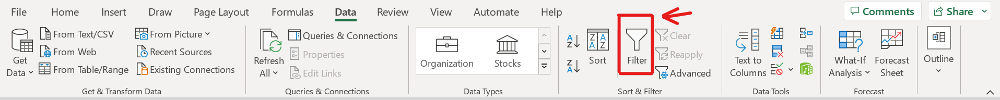
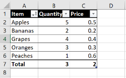
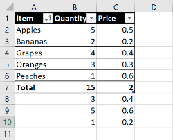
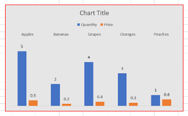

# The Basics of Microsoft Excel

## Introduction

Microsoft Excel is a powerful spreadsheet application used for organizing, analyzing, and storing data. This guide is intended for beginners who want to learn how to use Excel to organize and manipulate data.

## Task 1: Formatting a Table

### Overview

In this task, we will format a table in Excel.

### Steps

1. Open Excel and create a new workbook by clicking on New -> Blank workbook.
2. Enter the following data into the first five rows of the worksheet:

    | Item     | Quantity | Price |
    |----------|----------|-------|
    | Apples   | 5        | 0.5   |
    | Oranges  | 3        | 0.3   |
    | Bananas  | 2        | 0.2   |
    | Grapes   | 4        | 0.4   |
    | Peaches  | 1        | 0.6   |

3. Select the entire table by clicking and dragging your cursor from cell A1 to cell C6.
4. Click on the Home tab and select "Format as Table". Choose a style that you like.
   
    
    
5. Add a total row by clicking on any one of the cells in the table
 a. Click on the "Table Design" tab
 b. Check the "Total Row" checkbox
 
    
     
     

6. Click on the empty cell in the __Total__ row under the "Quantity" column. Select "Average" from the drop-down menu.
7. If the __Item__, __Quantity__, and __Price__ cells don't have drop-down arrows next to them, click anywhere on the table and then select the Data tab
8. Click "Filter"

 
 
9. Sort the table in alphabetical order by clicking on the drop-down arrow in the __Item__ column and selecting "Sort A to Z".
10. Click on the "File" Tab.
11. Click "Save As" to save your workbook (with a name of your choice) to a directory of your choice.

### Task 1 Conclusion

Congratulations! You have formatted a table in Excel, added a total row, filtered and sorted the data. Here's a reference of what your table should look like so far:
 
 

## Task 2: Using Formulas

### Overview

In this task, we will use formulas to perform calculations on data in Excel.

### Steps

1. Open the workbook you created in Task 1 (if it isn't already open).
 a. Click on the Open tab.
 b. Click on Recent; your workbook should be here.

2. In cell B7, replace the current formula by entering the formula "=SUM(B2:B6)" to calculate the total quantity.
3. In cell C7, replace the current formula by entering the formula "=SUM(C2:C6)" to calculate the total price.
4. In cell B8, enter the formula "=AVERAGE(B2:B6)" to calculate the average quantity.
5. In cell C8, enter the formula "=AVERAGE(C2:C6)" to calculate the average price.
6. In cell B9, enter the formula "=MAX(B2:B6)" to find the highest quantity.
7. In cell C9, enter the formula "=MAX(C2:C6)" to find the highest price.
8. In cell B10, enter the formula "=MIN(B2:B6)" to find the lowest quantity.
9. In cell C10, enter the formula "=MIN(C2:C6)" to find the lowest price.
10. Click on the File tab and then click Save.

### Task 2 Conclusion

Well done! You have used formulas to perform calculations on data in Excel. Here's a reference of what your table should look like so far:
 
 

## Task 3: Creating Charts

### Overview

In this task, we will create a chart to visualize data in Excel.

### Steps

1. Open the workbook you created in Task 1 (if it isn't already open).
2. Select cells A1:C6 by clicking on cell A1 and dragging down to cell C6.
3. Click on the Insert tab and select "Recommended Charts". For the sake of this guide we will use the first chart/"Clustered Column" chart. After selecting the chart click "OK".
4. Click on the chart to activate the Chart Design tab.
5. Click on the Chart Design tab and select "Quick Layout" -> "Layout 2".
6. Double click on one of the Item names in the chart; a "Format Axis" menu should appear on the right.
7. Scroll down this menu and open the "Labels" dropdown menu.
8. Change the "Label Position" from "Next to Axis" to "High". Close the "Format Axis" menu.
9. Click on the top left corner of the chart.
10. Click on the Format tab and select "Shape Fill" to change the background color of the chart to grey.
11. Still in the Format tab, select "Shape Outline" to change the chart border color to red.
12. Save your workbook.

### Task 3 Conclusion

Great job! You have created a chart in Excel, customized its layout, changed the data labels positions, and changed the chart color and style. Here's a reference of what your chart should look like:
 
 

### User Guide Conclusion

Congratulations! You now have a basic understanding on how to create and format a table, use formulas to preform calculations on table data, and create and customize a chart to visualize table data.
