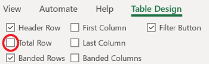

# The Basics of Microsoft Excel

## Introduction

Microsoft Excel is a powerful spreadsheet application used for organizing, analyzing, and storing data. This guide is intended for beginners who want to learn how to use Excel to organize and manipulate data.

## Task 1: Formatting a Table

### Overview

In this task, we will format a table in Excel.

### Steps

1. Open Excel and create a new workbook by clicking on New -> Blank workbook.
2. Enter the following data into the first five rows of the worksheet:

    | Item     | Quantity | Price |
    |----------|----------|-------|
    | Apples   | 5        | 0.5   |
    | Oranges  | 3        | 0.3   |
    | Bananas  | 2        | 0.2   |
    | Grapes   | 4        | 0.4   |
    | Peaches  | 1        | 0.6   |

3. Select the entire table by clicking and dragging your cursor from the __Item__ cell to the 0.6 cell.
4. Click on the Home tab and select "Format as Table". Choose a style that you like.
   
    
    
5. Add a total row by clicking on any one of the cells in the table
 a. Click on the Table Design tab
 b. Check the Total Row checkbox
    
     
     
6. Click on the empty cell in the total row under the "Quantity" column. Select "Average" from the drop-down menu.
7. Add a filter to the table by clicking on the Data tab and selecting "Filter".
8. Sort the table in ascending order by clicking on the drop-down arrow in the "Item" column and selecting "Sort A to Z".
9. Save your workbook.

### Conclusion

Congratulations! You have formatted a table in Excel, added a total row, filtered and sorted the data.

## Task 2: Using Formulas

### Overview

In this task, we will use formulas to perform calculations on data in Excel.

### Steps

1. Open the workbook you created in Task 1.
2. In cell A7, type "Total".
3. In cell B7, enter the formula "=SUM(B2:B6)" to calculate the total quantity.
4. In cell C7, enter the formula "=SUM(C2:C6)" to calculate the total price.
5. In cell B8, enter the formula "=AVERAGE(B2:B6)" to calculate the average quantity.
6. In cell C8, enter the formula "=AVERAGE(C2:C6)" to calculate the average price.
7. In cell B9, enter the formula "=MAX(B2:B6)" to find the highest quantity.
8. In cell C9, enter the formula "=MAX(C2:C6)" to find the highest price.
9. In cell B10, enter the formula "=MIN(B2:B6)" to find the lowest quantity.
10. In cell C10, enter the formula "=MIN(C2:C6)" to find the lowest price.
11. Save your workbook.

### Conclusion

Well done! You have used formulas to perform calculations on data in Excel.

## Task 3: Creating Charts

### Overview

In this task, we will create a chart to visualize data in Excel.

### Steps

1. Open the workbook you created in Task 1.
2. Select cells A1:C6 by clicking on cell A1 and dragging down to cell C6.
3. Click on the Insert tab and select "Recommended Charts". Choose a chart style that you like and click "OK".
4. Click on the chart to activate the Chart Tools tab.
5. Click on the Design tab and select "Chart Layouts" > "Layout 2".
6. Click on the Layout tab and choose "Show Data Labels".
7. Click on the Format tab and select "Shape Fill" to change the chart color.
8. Click on the Format tab and select "Shape Outline" to change the chart border color.
9. Click on the Design tab and select "Chart Styles" to change the chart style.
10. Save your workbook.

### Conclusion

Great job! You have created a chart in Excel, customized its layout, added data labels, changed the chart color and style.
